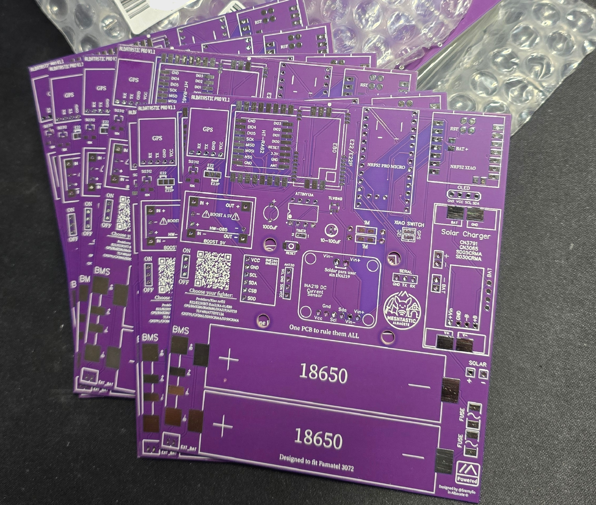
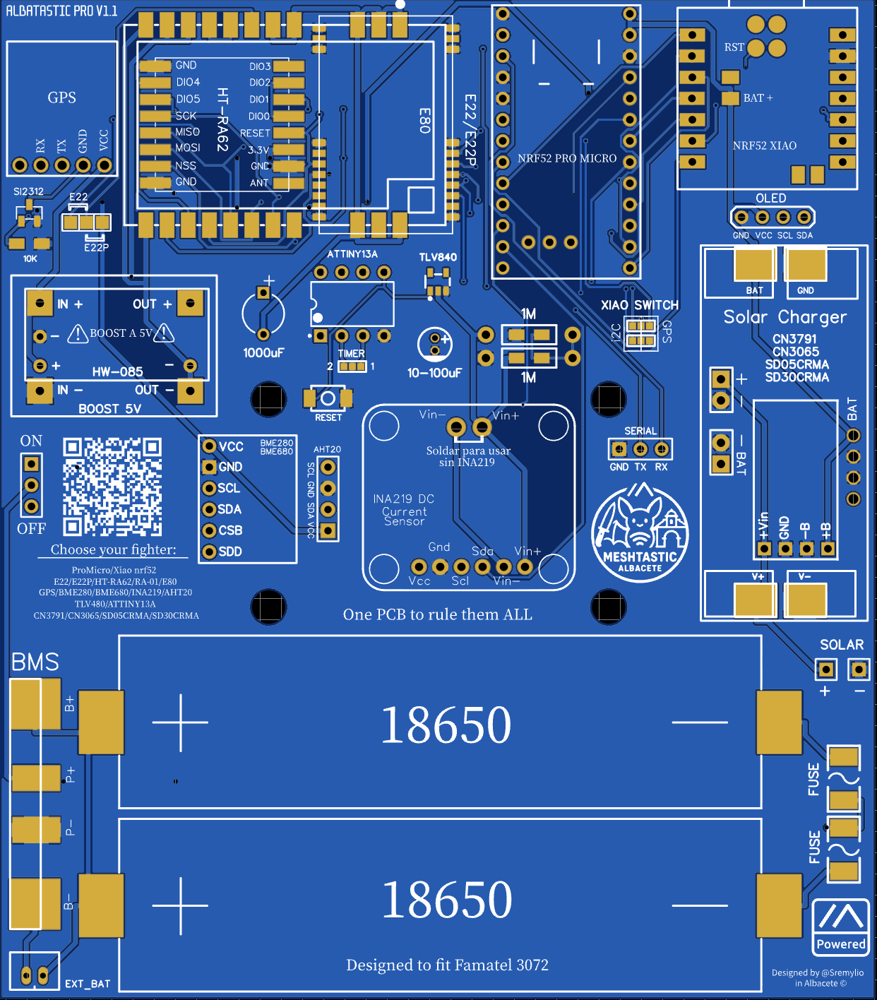
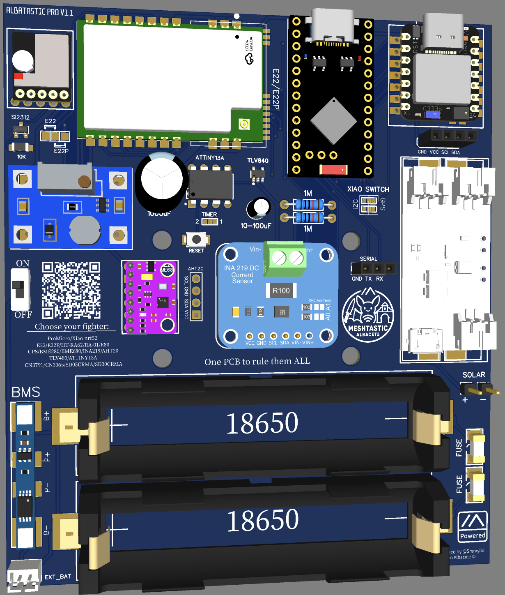
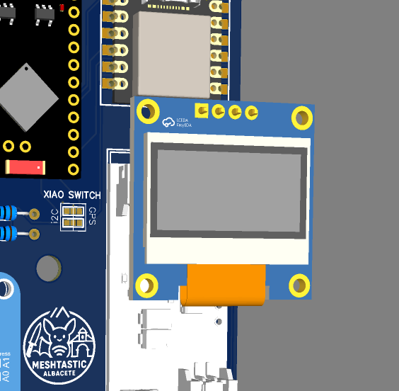
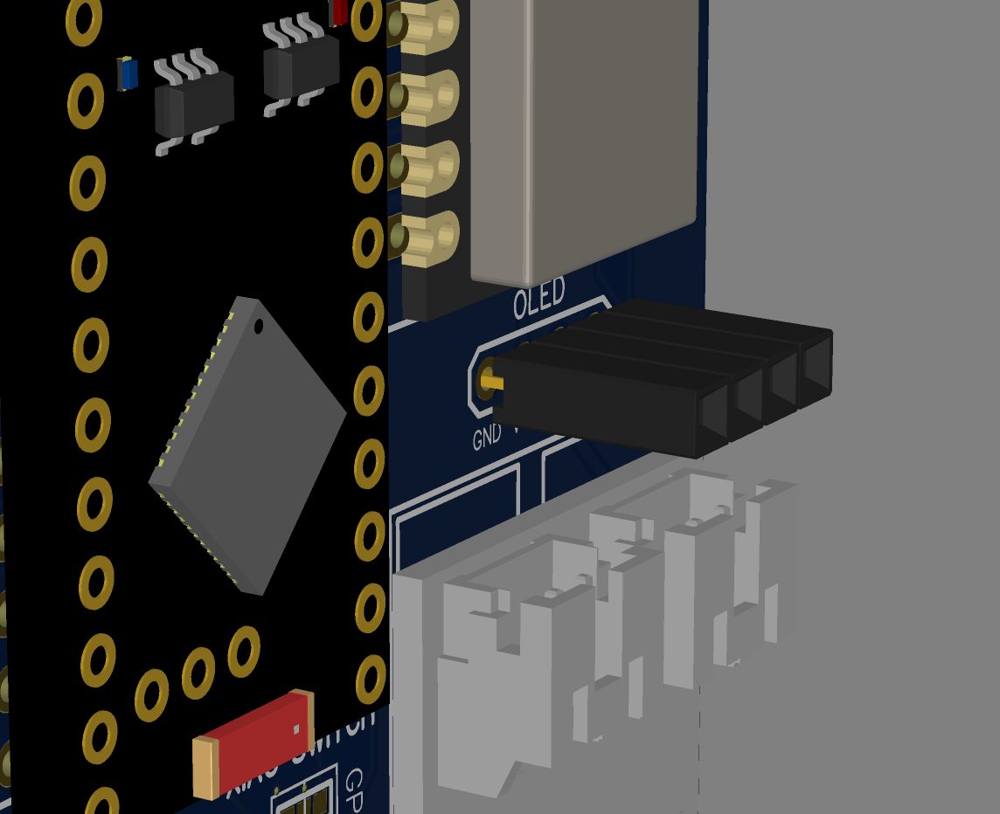
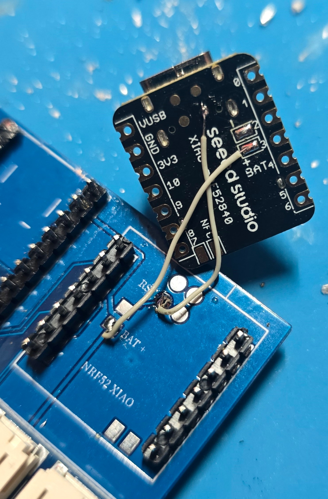

# Albatastic PRO - PCB Modular para Meshtastic

 # 🌍🇬🇧 [English version below](https://github.com/EmilioAL-Git/PCB-Albatastic-PRO?tab=readme-ov-file#-english-version)

> ⚖️ **Licencia: CC BY-NC 4.0 — Uso no comercial únicamente**  
> Este diseño es de libre uso y modificación, **pero queda prohibido cualquier uso comercial** sin autorización expresa del autor.

## Índice 📑

- 📝 [Changelog](https://github.com/EmilioAL-Git/PCB-Albatastic-PRO?tab=readme-ov-file#-changelog)
- 🔧 [Componentes Modulares](https://github.com/EmilioAL-Git/PCB-Albatastic-PRO?tab=readme-ov-file#-componentes-modulares---elige-tu-configuraci%C3%B3n)
- 📦 [Listado de Materiales (BOM)](https://github.com/EmilioAL-Git/PCB-Albatastic-PRO?tab=readme-ov-file#-listado-de-materiales-bom)
- 🚀 [Configuraciones Típicas](https://github.com/EmilioAL-Git/PCB-Albatastic-PRO?tab=readme-ov-file#-configuraciones-t%C3%ADpicas)
- 🎯 [Ventajas y Notas](https://github.com/EmilioAL-Git/PCB-Albatastic-PRO?tab=readme-ov-file#-ventajas)
- 📜 [Licencia](https://github.com/EmilioAL-Git/PCB-Albatastic-PRO?tab=readme-ov-file#-Licencia)

---

## Descripción

PCB modular diseñada para proyectos Meshtastic, dimensionada para integrarse en una [**caja Famatel 3072**](https://www.leroymerlin.es/productos/caja-de-conexion-estanca-150x110x63-mm-sin-conos-82049191.html). Filosofía "Choose your fighter": monta solo los componentes que necesites, pudiendo elegir entre varias opciones.

**Lema**: *"One PCB to rule them ALL"*

---

## 🏭 Proyecto patrocinado por PCBWay

  

Este proyecto ha sido fabricado y probado gracias al patrocinio de **PCBWay**, empresa líder en fabricación de PCBs y ensamblado electrónico.

Las placas recibidas presentan una **calidad de fabricación excelente**, con:
- Serigrafía nítida y precisa  
- Máscaras de soldadura perfectamente definidas  
- Vías y pistas limpias y bien alineadas  
- Acabados profesionales de nivel industrial

Gracias a esta calidad de fabricación, el proceso de montaje y prueba del hardware ha sido notablemente más fiable y sencillo, permitiendo validar el diseño de forma eficiente y con resultados muy satisfactorios.

Agradecimiento especial a **PCBWay** por apoyar el desarrollo de proyectos abiertos y comunitarios como **Albatastic PRO**.

  

---

# -- PCB EN PRUEBAS, LOS GERBERS ESTARÁN CUANDO SE PRUEBE BIEN -- #

---

## 📝 Changelog

| Versión | Estado  | Cambios principales |
|--------|----------------|---------------------|
| **v1.1** | 🧪 En pruebas | - Corregidos varios fallos de diseño detectados  - Añadido soporte **BME680**  - Añadido soporte **AHT20**  - Añadido **soporte SD30CRMA**  - Añadido **fusible por cada celda**  - Añadido **conector serial** para conexión entre PCBs  - Añadido **pulsador físico de reset**  - Añadida **pantalla OLED opcional**  - Mejoras generales |
| **v1.0** | ✅ Probada | - Versión inicial de **Albatastic PRO** |

---

## 🔧 Componentes Modulares - Elige tu Configuración

🧩 Diseño físico — <strong>Versión V1.0</strong>

 

  
  

---

### 🧩 Diseño físico — **Versión V1.1**

  
  

### 1️⃣ Microcontrolador Principal (Elige UNO)

**NRF52 XIAO** ⭐ Recomendado
- Nordic nRF52840
- Más fiable que ProMicro
- Menos posibilidades de accesorios

**ProMicro**
- nRF52840
- Más económico
- Posibilidad de tener sensores y GPS al mismo tiempo

---

### 2️⃣ Cargador Solar (Opcional - Elige UNO)

| Modelo | Entrada | Corriente | Características |
|--------|---------|-----------|-----------------|
| **CN3791** | 4.5-12V | hasta 2A | MPPT, paneles grandes (>6.5V) |
| **CN3065** | hasta 6.5V | hasta 500mA | Paneles pequeños (5-6V) |
| **SD05CRMA** | 4.4-6.5V | 1A | Ultra compacto, MPPT, paneles 5V |
| **SD30CRMA** | 9-18V | 1A | Salida ajustable para Liion y LiFepo4, MPPT, paneles hasta 18V |

---

### 3️⃣ Radio LoRa (Elige UNO)

| Modelo | Chip | Potencia TX | Características principales |
|--------|------|-------------|----------------------------|
| **E22** | SX1262 + PA | 30dBm (1W) | Máximo alcance, repetidores |
| **E22P** ⭐ | LLCC68/SX1262 | 30dBm (1W) | Similar al E22 pero con filtros incorporados |
| **HT-RA62** | SX1262 | 22dBm | Sensibilidad -134dBm, compacto |
| **RA-01** | SX1278 | 20dBm | Bajo coste, modelo antiguo usado principalmente en 433 Mhz |
| **E80**  | LR1121 | 22dBm/13dBm | **Banda dual** (Sub-GHz + 2.4GHz), LR-FHSS Muy novedoso |

---

### 4️⃣ Sensores (Opcionales - múltiples)

**GPS**
- Módulo externo
- Mosfet de activación

**BME280 / BME680 / BMP280 / AHT20**
- Temperatura, humedad, presión, gas (BME680)
- Interfaz I2C

**INA219**
- Monitor corriente/voltaje DC
- Interfaz I2C

---

### 5️⃣ Control Auxiliar (Opcionales)

**TLV840**
- Control de brownouts

**ATTINY13A**
- Reinicio cada X horas configurable
- Mas info aquí: https://github.com/incre77/attiny-reset

---

## ⚡ Sistema de Energía

**Bateria incorporada**
- 2x baterías 18650 en paralelo
- Protección por BMS
- ~7000mAh capacidad total
- Fusible por celda

**Elevador DC-DC/Boost HW-085**
- Dos modelos universales
- Elevador DC-DC
- Salida 5V estable para E22/E22P

**Conectores**
- Solar +/-
- Interruptor ON/OFF

---

## 📦 Listado de Materiales (BOM)

Ver materiales

  
### 🧠 MCU (elige una)
- XIAO nRF52840  
  [Aliexpress](https://es.aliexpress.com/item/1005008326858009.html)
- ProMicro nRF52840  
  [Aliexpress](https://es.aliexpress.com/item/1005006271881076.html)

### ☀️ Cargador solar (elige uno)
- CN3791  
  [Aliexpress](https://es.aliexpress.com/item/4001079800497.html)
- CN3065  
  [Aliexpress](https://es.aliexpress.com/item/1005008860476794.html)
- SD05CRMA  
  [Aliexpress](https://es.aliexpress.com/item/1005010382091100.html)
- SD30CRMA  
  [Aliexpress](  https://es.aliexpress.com/item/1005006026796945.html)

### 📡 Radio LoRa (elige uno)
- E22 (SX1262 + PA)  
  [Aliexpress](https://es.aliexpress.com/item/1005001808243661.html)
- E22P  
  [Aliexpress](https://es.aliexpress.com/item/1005009791259954.html)
- HT-RA62  
  [Aliexpress](https://es.aliexpress.com/item/1005008517475656.html)
- RA-01 (SX1278)  
  [Aliexpress](https://es.aliexpress.com/item/1005010556589507.html)
- E80 (LR1121)  
  [Aliexpress](https://es.aliexpress.com/item/1005007763874630.html)

### 🌡️ Sensores (opcionales)
- BME280  
  [Aliexpress](https://es.aliexpress.com/item/1005008511564094.html)
- AHT20 + BMP280  
  [Aliexpress](https://es.aliexpress.com/item/1005010470729456.html)
- BME680
  [Aliexpress](https://es.aliexpress.com/item/1005009656538037.html)
- INA219  
  [Aliexpress](https://es.aliexpress.com/item/1005005835269275.html)
- GPS NEO-6M / similar  
  [Aliexpress](https://es.aliexpress.com/item/1005008476063712.html)

### ⚡ Energía
- BMS 
  [Aliexpress](https://es.aliexpress.com/item/1005009337321904.html)
- Batería 18650 (Mi recomendación)  
  [NKON](https://www.nkon.nl/es/samsung-inr18650-35e-3400mah-8a.html)
- Fusibles (1 por cada celda, 1A–3A)
  [Aliexpress](https://es.aliexpress.com/item/1005002366334753.html)
- Boost DC-DC HW-085 (Opción 1) ⚠️ Configurar a 5V (Quitar resistencias A y B) 
  [Aliexpress](https://es.aliexpress.com/item/1005006818054730.html)
- Boost DC-DC (Opción 2)  
  [Aliexpress](https://es.aliexpress.com/item/1005008051438437.html)

### 🔌 Conectores y varios
- Conector UART / Serial / Solar  
  Pines sobrantes de los demás componentes
- Interruptor ON/OFF  
  [Aliexpress](https://es.aliexpress.com/item/1005005633418066.html)
- Pulsador RESET  
  [Aliexpress](https://es.aliexpress.com/item/4001125532910.html)
- Supervisor TLV840  
  [Aliexpress](https://es.aliexpress.com/item/1005009355692739.html)
- Attiny13A (Reset automático)  
  [Aliexpress](https://es.aliexpress.com/item/1005010090899908.html)

  

### ☔ Caja estanca
 - [**Famatel 3072**](https://www.leroymerlin.es/productos/caja-de-conexion-estanca-150x110x63-mm-sin-conos-82049191.html)

---

## 🚀 Configuraciones Típicas

**Básica**
- NRF52 XIAO + HT-RA62 + 2x18650

**Solar**
- Básica + SD05CRMA + Panel 5V

**Completa**
- Solar + GPS + BME280 + INA219 + ATTINY13A + TLV840

**Banda Dual**
- NRF52 XIAO + E80 

---

### 🔌 Conector Serial (UART)

El conector serial permite interconectar dos Albatastic PRO mediante UART (TX/RX/GND) para intercambiar datos localmente.  
Se puede usar para que una PCB actúe como **puente** entre dos nodos Meshtastic con **presets o frecuencias distintas**.  
Por ejemplo, una placa puede operar en **LongFast** y la otra en **MediumFast**, reenviando mensajes entre ambas por serial.  
Este enlace no usa LoRa, por lo que es rápido, estable y no consume airtime.  
Ideal para nodos gateway, repetidores híbridos o bridges multi-banda.

*Sólo para ProMicro*

> Configuracion en módulo Serial:
> - Serial: Enabled
> - RX: 8
> - TX: 6
> - Serial baud rate: 115200
> - Timeout: 0
> - Serial mode: TEXTMSG

---

## 🖥️ Pantalla OLED (Opcional)

Soporte para pantalla **OLED I2C 0.96" SSD1306** para visualización de estado:
- Nodo activo
- Señal LoRa
- Voltaje de batería
- Estado GPS / sensores

La pantalla puede instalarse o retirarse sin afectar al funcionamiento del nodo.

---

## 🎯 Ventajas

✅ Modular: solo montas lo que necesitas  
✅ Económico: no pagas componentes sin usar  
✅ Escalable: añade sensores después  
✅ Integración perfecta en Famatel 3072  
✅ Producción: SMD una sola cara  

---

## Notas Importantes

> ⚠️ **Importante**: El XIAO nRF52 comparte pines entre GPS (UART) e I2C. Debes elegir:
> - **GPS**: Para mantener la hora y localización (desactiva I2C)
> - **I2C**: Para sensores BME280/INA219 (desactiva GPS)
> 
> No puedes usar ambos simultáneamente con XIAO nRF52.
>
> Para hacer funcionar tanto el GPS como los sensores I2C debes flashear el firmware modificado que hay en la carpeta del repositorio. (Habilitan el uso de los pines D6 y D7)
>
> Es necesario conectar los cables de Reset y Bat+ por debajo del Xiao para que funcione:

---

## ⚙️ Configuración en la APP

> Pines GPS XIAO:
> - GPS receive: Pin 6
> - GPS Transmit: Pin 7
> - GPS Enable: Pin 0
>
>  Pines GPS ProMicro:
> - GPS receive: Pin 20
> - GPS Transmit: Pin 22
> - GPS Enable: Pin 24
 
---

## Autor y Versión

**Diseñado por**: [@Sremylio](https://telegram.me/sremylio) para MESHTASTIC ALBACETE  
**Versión**: PRO V1.1  

**¡Choose your fighter y monta tu nodo ideal!** 🚀

## 📜 Licencia

Este proyecto se distribuye bajo la licencia:

**Creative Commons Attribution–NonCommercial 4.0 International (CC BY-NC 4.0)**

Esto significa que puedes:
- Usar el diseño
- Modificarlo
- Compartirlo

Siempre que:
- Reconozcas al autor original
- **NO lo utilices con fines comerciales**

Queda **expresamente prohibido** fabricar, vender o distribuir este diseño con fines comerciales sin autorización expresa del autor.

Más información sobre la licencia:
https://creativecommons.org/licenses/by-nc/4.0/

---
---

# 🇬🇧 ENGLISH VERSION

# Albatastic PRO - Modular PCB for Meshtastic

> ⚖️ **License: CC BY-NC 4.0 — Non-commercial use only**  
> This design is free to use and modify, **but any commercial use is prohibited** without express authorization from the author.

## Table of Contents 📑

- 📝 [Changelog](#-changelog-1)
- 🔧 [Modular Components](#-modular-components---choose-your-configuration)
- 📦 [Bill of Materials (BOM)](#-bill-of-materials-bom)
- 🚀 [Typical Configurations](#-typical-configurations)
- 🎯 [Advantages and Notes](#-advantages)
- 📜 [License](#-license-1)

---

## Description

Modular PCB designed for Meshtastic projects, sized to fit inside a [**Famatel 3072 box**](https://www.leroymerlin.es/productos/caja-de-conexion-estanca-150x110x63-mm-sin-conos-82049191.html). "Choose your fighter" philosophy: mount only the components you need, with multiple options to choose from.

**Motto**: *"One PCB to rule them ALL"*

---

## 🏭 Project Sponsored by PCBWay

  

This project has been manufactured and tested thanks to sponsorship from **PCBWay**, a leading company in PCB manufacturing and electronic assembly.

The received boards show **excellent manufacturing quality**, with:
- Sharp and precise silkscreen  
- Perfectly defined solder masks  
- Clean and well-aligned vias and traces  
- Industrial-level professional finishes

Thanks to this manufacturing quality, the hardware assembly and testing process has been notably more reliable and straightforward, allowing efficient design validation with very satisfactory results.

Special thanks to **PCBWay** for supporting the development of open and community projects like **Albatastic PRO**.

  

---

# -- PCB UNDER TESTING, GERBERS WILL BE AVAILABLE ONCE FULLY TESTED -- #

---

## 📝 Changelog

| Version | Status  | Main Changes |
|--------|----------------|---------------------|
| **v1.1** | 🧪 Testing | - Fixed several detected design flaws  - Added **BME680** support  - Added **AHT20** support  - Added **SD30CRMA support**  - Added **fuse per cell**  - Added **serial connector** for inter-PCB connection  - Added **physical reset button**  - Added **optional OLED display**  - General improvements |
| **v1.0** | ✅ Tested | - Initial version of **Albatastic PRO** |

---

## 🔧 Modular Components - Choose Your Configuration

🧩 Physical Design — <strong>Version V1.0</strong>

 

  
  

---

### 🧩 Physical Design — **Version V1.1**

  
  

### 1️⃣ Main Microcontroller (Choose ONE)

**NRF52 XIAO** ⭐ Recommended
- Nordic nRF52840
- More reliable than ProMicro
- Fewer accessory possibilities

**ProMicro**
- nRF52840
- More affordable
- Possibility to have sensors and GPS simultaneously

---

### 2️⃣ Solar Charger (Optional - Choose ONE)

| Model | Input | Current | Features |
|--------|---------|-----------|-----------------|
| **CN3791** | 4.5-12V | up to 2A | MPPT, large panels (>6.5V) |
| **CN3065** | up to 6.5V | up to 500mA | Small panels (5-6V) |
| **SD05CRMA** | 4.4-6.5V | 1A | Ultra compact, MPPT, 5V panels |
| **SD30CRMA** | 9-18V | 1A | Adjustable output for Liion and LiFepo4, MPPT, panels up to 18V |

---

### 3️⃣ LoRa Radio (Choose ONE)

| Model | Chip | TX Power | Main Features |
|--------|------|-------------|----------------------------|
| **E22** | SX1262 + PA | 30dBm (1W) | Maximum range, repeaters |
| **E22P** ⭐ | LLCC68/SX1262 | 30dBm (1W) | Similar to E22 but with built-in filters |
| **HT-RA62** | SX1262 | 22dBm | -134dBm sensitivity, compact |
| **RA-01** | SX1278 | 20dBm | Low cost, old model mainly used on 433 MHz |
| **E80**  | LR1121 | 22dBm/13dBm | **Dual band** (Sub-GHz + 2.4GHz), LR-FHSS Very novel |

---

### 4️⃣ Sensors (Optional - multiple)

**GPS**
- External module
- Mosfet activation

**BME280 / BME680 / BMP280 / AHT20**
- Temperature, humidity, pressure, gas (BME680)
- I2C interface

**INA219**
- DC current/voltage monitor
- I2C interface

---

### 5️⃣ Auxiliary Control (Optional)

**TLV840**
- Brownout control

**ATTINY13A**
- Configurable restart every X hours
- More info here: https://github.com/incre77/attiny-reset

---

## ⚡ Power System

**Built-in Battery**
- 2x 18650 batteries in parallel
- BMS protection
- ~7000mAh total capacity
- Fuse per cell

**DC-DC Boost Converter HW-085**
- Two universal models
- DC-DC booster
- Stable 5V output for E22/E22P

**Connectors**
- Solar +/-
- ON/OFF switch

---

## 📦 Bill of Materials (BOM)

View materials

  
### 🧠 MCU (choose one)
- XIAO nRF52840  
  [Aliexpress](https://es.aliexpress.com/item/1005008326858009.html)
- ProMicro nRF52840  
  [Aliexpress](https://es.aliexpress.com/item/1005006271881076.html)

### ☀️ Solar charger (choose one)
- CN3791  
  [Aliexpress](https://es.aliexpress.com/item/4001079800497.html)
- CN3065  
  [Aliexpress](https://es.aliexpress.com/item/1005008860476794.html)
- SD05CRMA  
  [Aliexpress](https://es.aliexpress.com/item/1005010382091100.html)
- SD30CRMA  
  [Aliexpress](https://es.aliexpress.com/item/1005006026796945.html)

### 📡 LoRa Radio (choose one)
- E22 (SX1262 + PA)  
  [Aliexpress](https://es.aliexpress.com/item/1005001808243661.html)
- E22P  
  [Aliexpress](https://es.aliexpress.com/item/1005009791259954.html)
- HT-RA62  
  [Aliexpress](https://es.aliexpress.com/item/1005008517475656.html)
- RA-01 (SX1278)  
  [Aliexpress](https://es.aliexpress.com/item/1005010556589507.html)
- E80 (LR1121)  
  [Aliexpress](https://es.aliexpress.com/item/1005007763874630.html)

### 🌡️ Sensors (optional)
- BME280  
  [Aliexpress](https://es.aliexpress.com/item/1005008511564094.html)
- AHT20 + BMP280  
  [Aliexpress](https://es.aliexpress.com/item/1005010470729456.html)
- BME680
  [Aliexpress](https://es.aliexpress.com/item/1005009656538037.html)
- INA219  
  [Aliexpress](https://es.aliexpress.com/item/1005005835269275.html)
- GPS NEO-6M / similar  
  [Aliexpress](https://es.aliexpress.com/item/1005008476063712.html)

### ⚡ Power
- BMS 
  [Aliexpress](https://es.aliexpress.com/item/1005009337321904.html)
- 18650 Battery (My recommendation)  
  [NKON](https://www.nkon.nl/es/samsung-inr18650-35e-3400mah-8a.html)
- Fuses (1 per cell, 1A–3A)
  [Aliexpress](https://es.aliexpress.com/item/1005002366334753.html)
- DC-DC Boost HW-085 (Option 1) ⚠️ Configure to 5V (Remove resistors A and B) 
  [Aliexpress](https://es.aliexpress.com/item/1005006818054730.html)
- DC-DC Boost (Option 2)  
  [Aliexpress](https://es.aliexpress.com/item/1005008051438437.html)

### 🔌 Connectors and misc
- UART / Serial / Solar connector  
  Spare pins from other components
- ON/OFF switch  
  [Aliexpress](https://es.aliexpress.com/item/1005005633418066.html)
- RESET button  
  [Aliexpress](https://es.aliexpress.com/item/4001125532910.html)
- TLV840 Supervisor  
  [Aliexpress](https://es.aliexpress.com/item/1005009355692739.html)
- Attiny13A (Automatic reset)  
  [Aliexpress](https://es.aliexpress.com/item/1005010090899908.html)

### ☔ Waterproof box
 - [**Famatel 3072**](https://www.leroymerlin.es/productos/caja-de-conexion-estanca-150x110x63-mm-sin-conos-82049191.html)

---

## 🚀 Typical Configurations

**Basic**
- NRF52 XIAO + HT-RA62 + 2x18650

**Solar**
- Basic + SD05CRMA + 5V Panel

**Complete**
- Solar + GPS + BME280 + INA219 + ATTINY13A + TLV840

**Dual Band**
- NRF52 XIAO + E80 

---

### 🔌 Serial Connector (UART)

The serial connector allows interconnecting two Albatastic PRO boards via UART (TX/RX/GND) to exchange data locally.  
It can be used so one PCB acts as a **bridge** between two Meshtastic nodes with **different presets or frequencies**.  
For example, one board can operate on **LongFast** and the other on **MediumFast**, forwarding messages between them via serial.  
This link doesn't use LoRa, so it's fast, stable, and doesn't consume airtime.  
Ideal for gateway nodes, hybrid repeaters, or multi-band bridges.

*ProMicro only*

> Serial module configuration:
> - Serial: Enabled
> - RX: 8
> - TX: 6
> - Serial baud rate: 115200
> - Timeout: 0
> - Serial mode: TEXTMSG

---

## 🖥️ OLED Display (Optional)

Support for **OLED I2C 0.96" SSD1306** display for status visualization:
- Active node
- LoRa signal
- Battery voltage
- GPS / sensor status

The display can be installed or removed without affecting node operation.

---

## 🎯 Advantages

✅ Modular: mount only what you need  
✅ Economical: don't pay for unused components  
✅ Scalable: add sensors later  
✅ Perfect integration in Famatel 3072  
✅ Production: SMD single side  

---

## Important Notes

> ⚠️ **Important**: The XIAO nRF52 shares pins between GPS (UART) and I2C. You must choose:
> - **GPS**: To maintain time and location (disables I2C)
> - **I2C**: For BME280/INA219 sensors (disables GPS)
> 
> You cannot use both simultaneously with XIAO nRF52.
>
> To make both GPS and I2C sensors work, you must flash the modified firmware in the repository folder. (Enables use of D6 and D7 pins)
>
> It's necessary to connect the Reset and Bat+ cables underneath the Xiao for it to work:

---

## ⚙️ APP Configuration

> XIAO GPS pins:
> - GPS receive: Pin 6
> - GPS Transmit: Pin 7
> - GPS Enable: Pin 0
>
>  ProMicro GPS pins:
> - GPS receive: Pin 20
> - GPS Transmit: Pin 22
> - GPS Enable: Pin 24
 
---

## Author and Version

**Designed by**: [@Sremylio](https://telegram.me/sremylio) for MESHTASTIC ALBACETE  
**Version**: PRO V1.1  

**Choose your fighter and build your ideal node!** 🚀

## 📜 License

This project is distributed under the license:

**Creative Commons Attribution–NonCommercial 4.0 International (CC BY-NC 4.0)**

This means you can:
- Use the design
- Modify it
- Share it

As long as you:
- Credit the original author
- **DO NOT use it for commercial purposes**

It is **expressly prohibited** to manufacture, sell, or distribute this design for commercial purposes without express authorization from the author.

More information about the license:
https://creativecommons.org/licenses/by-nc/4.0/
